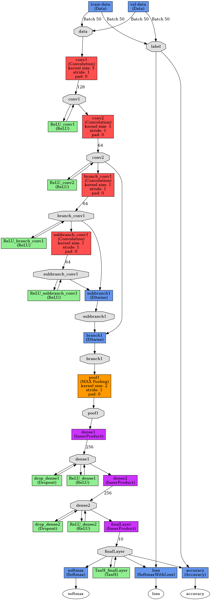
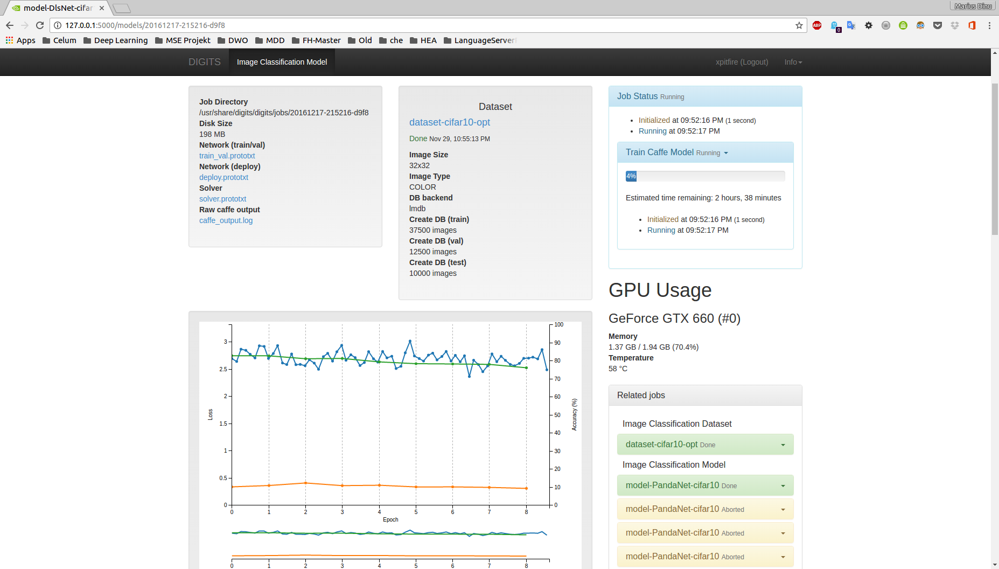
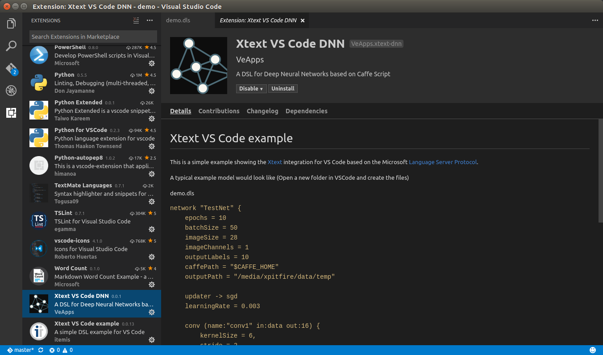
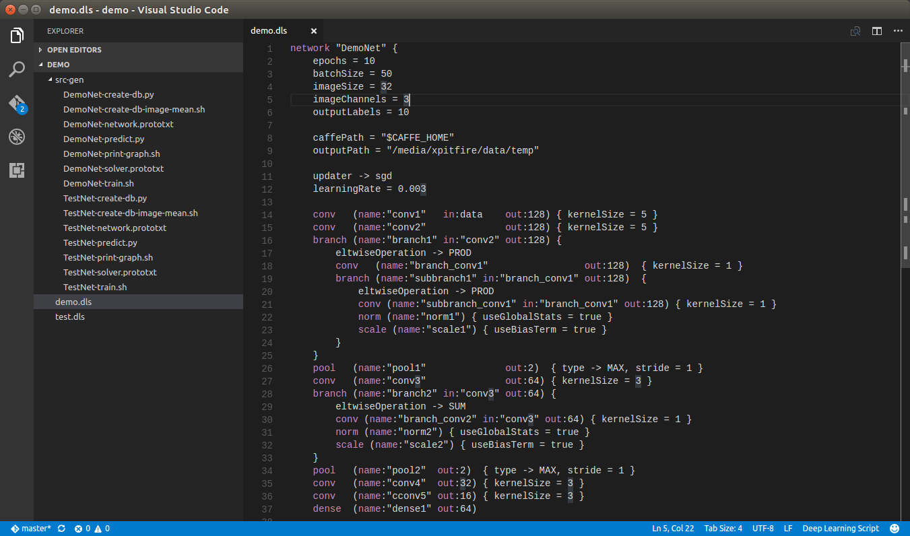
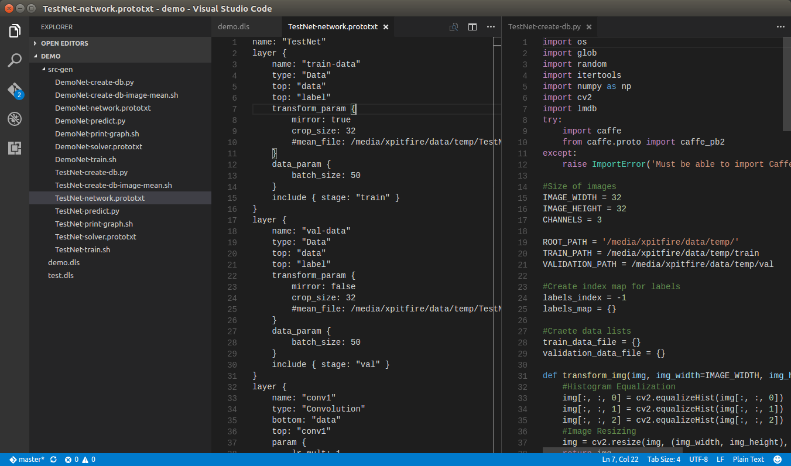
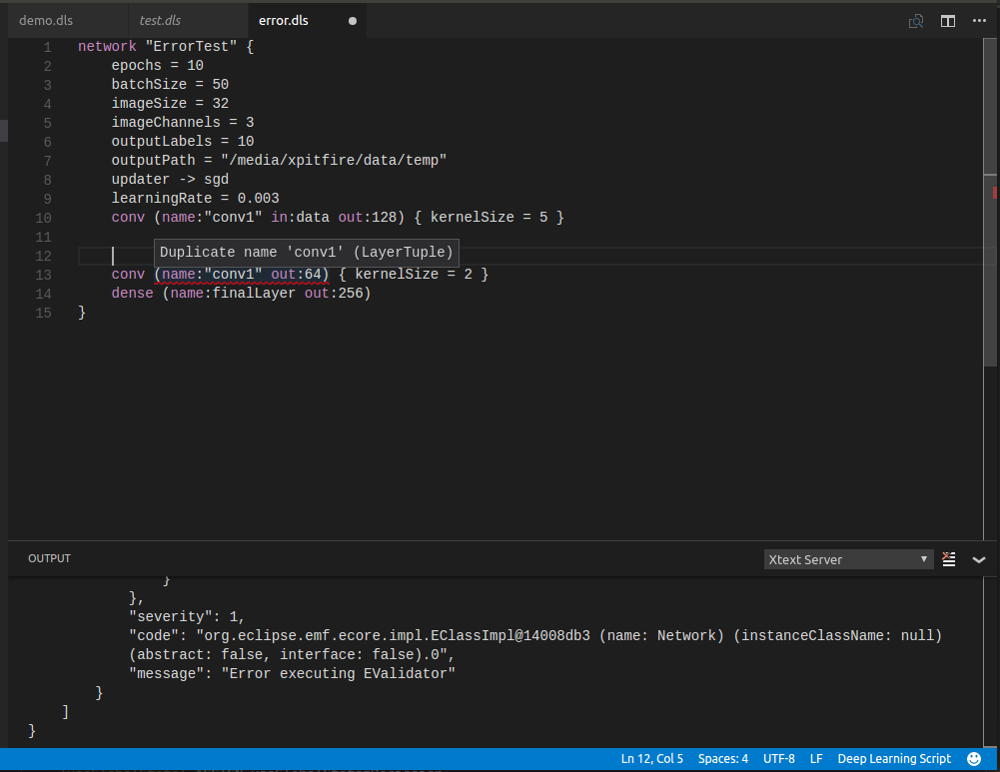
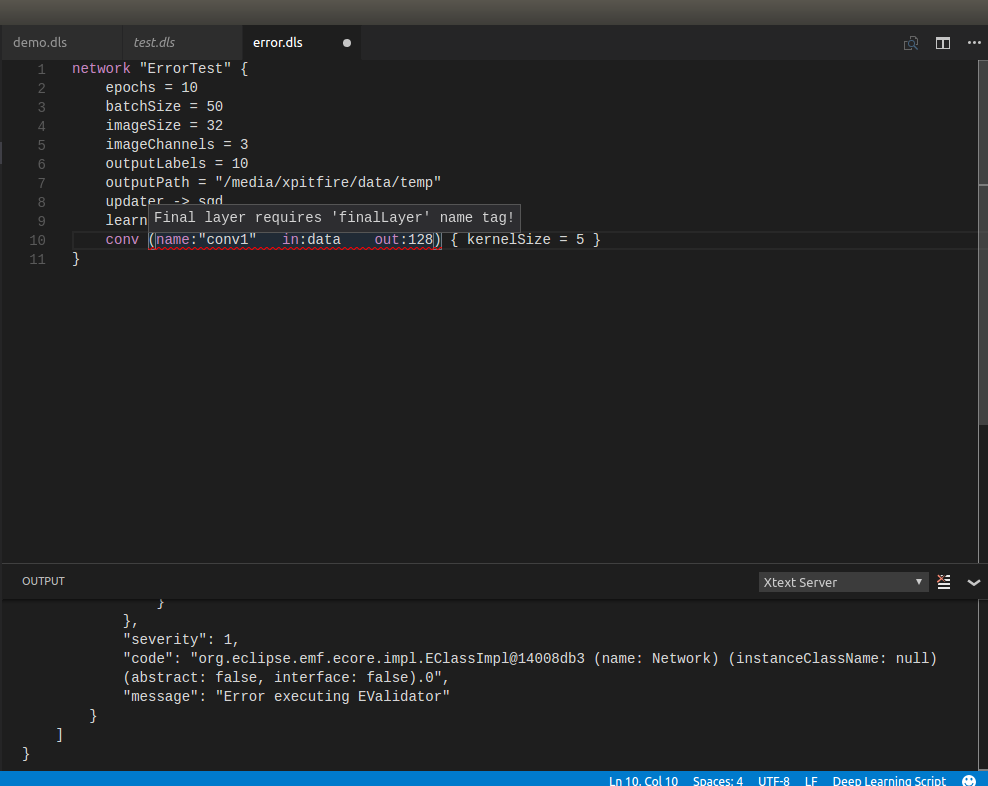
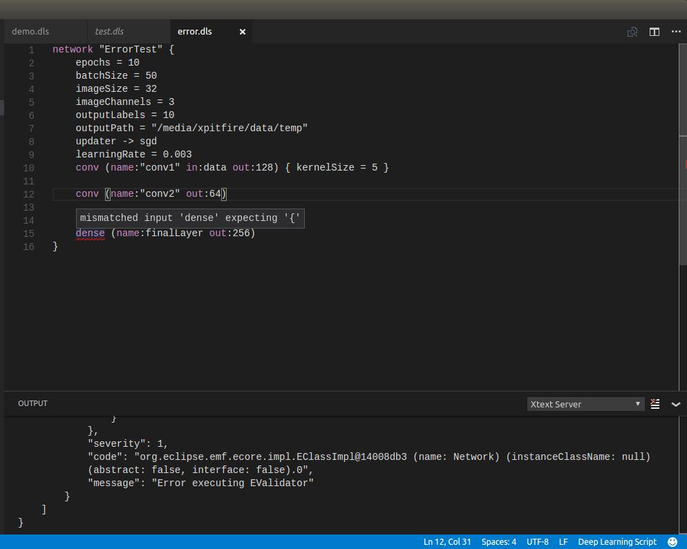
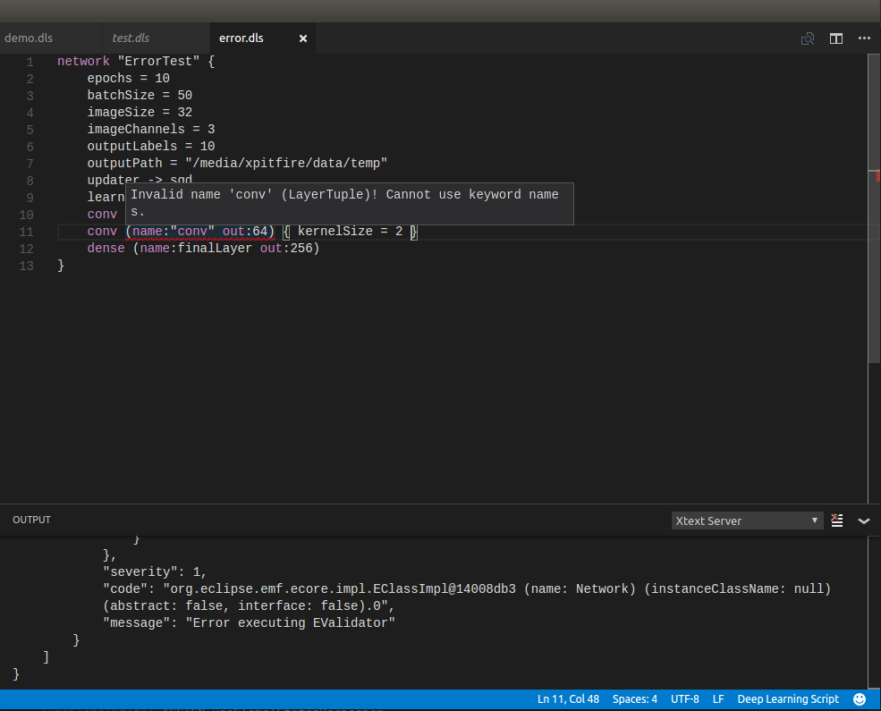

Deep Learning Script
====================

Introduction
------------

Deep Learning is one of the most popular research topics in 2016. It was
only recently that computational improvements based on better performing
hardware and the increasing amount of data enabled new opportunities in
this interesting field of research. Since 2010 many frameworks emerged
offering more or less easy to use abstractions layers of the very
low-level and complex but highly optimized GPU based implementations
(mainly based on NVIDIA CUDA). It is hard work and time consuming to
implement and test Deep Neural Networks across multiple frameworks to
evaluate which of them is the most suitable for once purpose. The
following listing gives an overview of the currently most popular
frameworks available:

-   Microsoft CNTK (Brainscript)

-   Theano

-   Torch

-   NVIDIA Digits (Caffe Script)

-   Google Tensorflow

-   Keras (with Tensorflow or Theano backend)

-   Deeplearning4j (DL4J)

-   Deep Learning Toolbox (MATLAB)

This inspires to abstract from the individual framework peculiarities
and design a DSL, which intersects with the most commonly used features
available in Deep Learning for image classification. The outcome of this
project should ease the work for fast prototyping and offer a framework
independent notation.

The first targeted API is NVIDIA’s DIGITS Caffe-Script implementation.

To see the current status of development follow this link on
[GitHub](https://github.com/Xpitfire/xtext-dnn).

Technologies
------------

Due to the great technological advances of the last few months, Visual
Studio Code became a very interesting multi-platform development
environment and offers opportunities to create custom plugins and add
own language models. In combination with the Eclipse Xtext DSL
specification and TypeFox work for the language server protocol (LSP)
support, VS Code becomes a very appealing alternative to the classical
Xtext DSL approach on Eclipse. The data coupling/exchange between Xtext
(Java based) and VS Code is using a self-embedded NodeJS server to
exchange the information via LSP REST API.

DSL Specification
=================

Modern Deep Neural Networks are created by stacking multilayer
perceptrons, which learn different characteristics or apply different
operations on its previous layer activations. The most commonly used
layer types are listed below:

-   Convolutional layer

-   Dense or fully connected layer

-   Pooling layer

-   Batch normalization layer

-   Scaling layer

Furthermore some hyper-parameters are also required to perform gradient
updates, define learning rate behavior and set additional solver
relevant conditions and are defined at the beginning of new network
instance. The next chapter will reveal more details regarding the syntax
design.

Syntax Design
-------------

Basically the syntax format of the Deep Learning Script (\*.dls) is
similar to JSON coding styling, but with some important differences:

-   The comma ’,’ operator is optional and can be used to separate
    between layers, variables or properties

-   The equals ’=’ operator represents assignments, which assigns self
    defined values to the predefined environmental variables

-   The reference ’-&gt;’ operator represents constant value references,
    enabling the selection between predefined values or enumerations

-   The parentheses ’(’, ’)’ are used to declare the layer header /
    declaration section

-   The colon ’:’ operator represents a property definition for the
    layer header / declaration types

-   The curly brackets ’{’, ’}’ define scopes of the overall network,
    the layers or branches created within a model

-   The square brackets ’\[’, ’\]’ define short notation possibility for
    dense layers and have similar behavior as in many programming
    languages and can be seen as arrays of chained dense layers

-   The script support single line comments denoted with two slashes
    ’//’ or multi-line comments starting with ’/\*’ and ending with
    ’\*/’

The following listing gives an overview of the main preamble properties:

epochs

:   The number of training epochs \[integer\]

imageSize

:   The image format size \[integer\]: e.g. the value 28 means an input
    image format of 28x28

imageChannels

:   This represents the input image channels depth \[integer\]: e.g. for
    RGB channels use the value 3 or for grayscale the value 1

batchSize

:   The batch size used for the mean gradient computation \[integer\]

outputSize

:   The number of output classes for the last layer (softmax layer)
    \[integer\]

outputPath

:   Sets the output root paths, which are referenced by the generated
    files \[string\]

trainDataPath

:   (OPTIONAL) The path to the train dataset \[string\]. The default
    setting is ’&lt;outputPath&gt;/train’

valDataPath

:   (OPTIONAL) The path to the validation dataset \[string\]. The
    default setting is ’&lt;outputPath&gt;/val’

caffePath

:   (OPTIONAL) Sets the path to the Caffe framework
    installation \[string\]. The default path is “\~/caffe”

seed

:   (OPTIONAL) Defines a seed to enable replication of test
    runs \[integer\]. The default value is 0 (represents non-active
    seed value)

updater

:   Defines the used gradient updater method \[enum: sgd | adam |
    adadelta | nestrovs | adagrad | rmsprop\]

learningRate

:   Defines the generally used learning rate \[floating point number or
    exponential notation\]: e.g. 0.0001 or 1e-04

The keywords are listed below:

network

:   Defines the network entrance point (only one network definition per
    file allowed)

name

:   The ’name’ keyword requires a string definition or a special token
    ’finalLayer’ to determine the last layer \[string | finalLayer\]

in

:   The ’in’ keyword defines input values for each layer. Input values
    are integers or a special ’data’ keyword, which references to the
    labeled dataset input \[string | data\]. By default the first layer
    references to the training dataset

out

:   This keyword represents the number of output values. The assigned
    values are of type integer, but the semantics of output may vary
    according to the currently available layer type \[integer\]

conv

:   Defines a convolutional layer, whereas the ’out’ keyword represents
    the number of output feature maps (depth of the convolutional layer)

dense

:   The ’dense’ keyword represents a fully connected layer, whereas the
    ’out’ keyword denotes the number of output neurons

pool

:   This keyword creates a pooling layer, whereas the ’out’ keyword
    defines the operation of the ’MAX’ or ’AVG’ pooling size

norm

:   The ’norm’ keyword represents a batch normalization layer and does
    not allow any ’in’ or ’out’ definitions. The values of the previous
    concrete layers is forwarded

scale

:   The ’scale’ keyword represents a scaling layer and does not allow
    any ’in’ or ’out’ definitions. The values of the previous concrete
    layers is forwarded

branch

:   The ’branch’ keyword is special network markup, which denotes a
    split operation, whereas two branches are created and where the
    first part propagates the inputs without any changes according to
    the original branch signature and the other part uses the user
    defined layers to operate on the values. This keyword enables more
    complex network architectures, such as residual network
    architectures

The next chapter will reveal more details regarding the layer
definition.

Layer details
-------------

Layers may also require a body definition, which has mandatory and/or
optional properties, to fulfill the layer specific tasks.

Convolutional or dense layers offer additional body settings such as:

activation

:   (OPTIONAL) This property sets the activation function behavior
    \[enum: ReLU | Sigmoid | TanH\]. The default setting is ’ReLU’

weightsInit

:   (OPTIONAL) This property sets the weights initialization type
    \[enum: xavier | constant | gaussian\]. Default setting is ’xavier’

biasInit

:   (OPTIONAL) This property sets the bias initialization type \[enum:
    xavier | constant | gaussian\]. Default setting is ’constant’

dropout

:   (OPTIONAL) This property sets the dropout rate \[floating
    point number\]. By default dropout is disabled

The Convolutional layers have additional setting as shown below:

kernelSize

:   This denotes the size of the receptive field used for the
    convolution

stride

:   (OPTIONAL) The stride sets the skipped steps of the
    convolution \[integer\]. The default value is 1

The Pooling layers have additional setting as shown below:

type

:   Defines the type of pooling \[enum: MAX | AVG\]

stride

:   (OPTIONAL) The stride sets the skipped steps of the
    pooling \[integer\]. The default value is 1

The above shown properties represent the most important settings
available within the Deep Learning Script. Additional settings will be
shown in the next chapter within the DSL Xtext definition.

Xtext Definition
================

The following listing shows the Xtext DSL definition for the Deep
Learning Script (\*.dls):

Example
=======

The following listing shows an exemplary network:

Generated Output
================

The generated output contains of seven dedicated files:

create-db.py

:   A python based script to generate a LMDB based database mapping for
    the training images.

network.prototxt

:   The Deep Neural Network architecture model file

post-db-image.sh

:   A script to generate the mean image representation of an
    pre-processed database

predict.py

:   A python based prediction script to load a pre-trained model and
    classify images

print-graph.sh

:   A shell script to generate a graph from a network model file

solver.prototxt

:   A solver definition for training a model

train.sh

:   A shell script to train a deep neural network

Model Graph
===========

Model Execution
===============

VS Code Integration
===================

DSL Limitations
===============

The first version of the Deep Learning Script is not only limited to the
variety of available languages, but also due to some technical
limitations restricted to some basic IDE supported features. Due to the
“still-in-development-status” of Xtext and Visual Studio Code the next
version needs to improve the following features:

-   Fix auto-completion

-   Perform syntax checks frequently, not only on save

-   Add quick fixes

-   Add additional languages

-   Extend the layer flexibility for the Deep Learning Script to realize
    inception architectures and additional residual architectures

-   Extend the layer options to support varying learning rates,
    padding, etc.

-   Implement an abstracted internal model architecture to enable future
    extensibility

